<h1 align="center">✦ ARQON — THE VAULT ✦</h1>
<h3 align="center">Plataforma de Locação de Roupas e Artefatos de Luxo</h3>

<p align="center">
  <em>"A ARQON não é uma loja. É um cofre. Cada peça é um artefato. Cada aluguel é uma experiência."</em>
</p>

<p align="center">
  
  
  
  
</p>

<p align="center">
  
  
  
  
  
</p>

<br>

<h2 align="center">🌐 Acesse o Site Online</h2>

<p align="center">
  <a href="https://SEU-SITE.infinityfreeapp.com" target="_blank">
    
  </a>
</p>

<p align="center">
  <a href="https://SEU-SITE.infinityfreeapp.com" target="_blank">
    
  </a>
  <a href="https://github.com/Breno-J-Oliveira" target="_blank">
    
  </a>
</p>

<p align="center">
  <sub>👆 <em>Clique no botão dourado para abrir a plataforma ARQON — THE VAULT no navegador.</em></sub>
</p>

---

## 📑 Índice

1. [Acesso ao Site Online](#-acesso-ao-site-online)
2. [Contexto Acadêmico do Projeto](#-contexto-acadêmico-do-projeto)
3. [Sobre o Projeto](#-sobre-o-projeto)
4. [Demonstração e Capturas de Tela](#-demonstração-e-capturas-de-tela)
5. [Stack Tecnológico Completo](#-stack-tecnológico-completo)
6. [Arquitetura do Sistema](#-arquitetura-do-sistema)
7. [Funcionalidades Completas](#-funcionalidades-completas)
8. [Telas / Páginas do Sistema](#-telas--páginas-do-sistema)
9. [API RESTful — Todas as Rotas](#-api-restful--todas-as-rotas)
10. [Controllers, Models e Middlewares](#-controllers-models-e-middlewares)
11. [Banco de Dados](#-banco-de-dados)
12. [Sistema de Autenticação e Níveis de Acesso](#-sistema-de-autenticação-e-níveis-de-acesso)
13. [Sistema de Tema Dinâmico](#-sistema-de-tema-dinâmico)
14. [Estrutura de Pastas](#-estrutura-de-pastas)
15. [Instalação e Configuração](#-instalação-e-configuração)
16. [Deploy no InfinityFree](#-deploy-no-infinityfree)
17. [Segurança](#-segurança)
18. [Paleta de Cores e Identidade Visual](#-paleta-de-cores-e-identidade-visual)
19. [Equipe](#-equipe)
20. [Contatos](#-contatos)

---

## 🌐 Acesso ao Site Online

A plataforma está hospedada gratuitamente no **InfinityFree**. Clique no botão abaixo para acessar:

<p align="center">
  <a href="https://SEU-SITE.infinityfreeapp.com" target="_blank">
    
  </a>
</p>

| Item | Valor |
|---|---|
| **URL do Site** | `https://arquon.infinityfree.io/index.html` |
| **Hospedagem** | InfinityFree (PHP + MySQL gratuito) |
| **Login Admin** | `admin@arqon.com` / `admin123` |
| **Login Membro** | `user@arqon.com` / `user123` |

---

## 🎓 Contexto Acadêmico do Projeto

<p align="center">
  
  
  
</p>

Este projeto foi desenvolvido como atividade acadêmica do **2º Termo — 1º Semestre de 2025**, em parceria fictícia com a **ABC Technology**. O desafio propõe criar soluções de **personalização e consumo sob demanda** dentro de cinco temas possíveis (aluguel de imóveis, vagas temporárias, **aluguel de roupas**, decoração de eventos e streaming).

A equipe escolheu o tema **Aluguel de Roupas**, dando origem ao **ARQON — THE VAULT**: uma locadora digital de roupas e artefatos de luxo, facilitando o acesso a peças premium para ocasiões especiais sem a necessidade de compra.

### Contexto do Desafio

Vivemos em uma era onde a **personalização e a flexibilidade** transformam a forma de consumir produtos e serviços. Modelos como benefícios flexíveis e a locação flexível (*flex stay*) mostram a busca por soluções adaptáveis às necessidades individuais. O objetivo do projeto é desenvolver soluções inovadoras que tornem esses serviços mais **acessíveis, intuitivos e alinhados às tendências de mercado**, dando ao usuário mais controle, liberdade e opções.

### Requisitos da Aplicação (Locadora) — Atendimento

| Requisito da Atividade | Status | Como foi atendido no ARQON |
|---|---|---|
| Autenticação com 2 perfis (admin e usuário) | ✅ | Sistema com perfis `MEMBER` (usuário) e `TOTAL_CONTROL` (admin), além de níveis extras |
| Cadastro de itens (admin) | ✅ | CRUD de produtos com upload de imagens no painel admin |
| Aluguel de item (com cálculo por dias) | ✅ | Carrinho + checkout com cálculo de diária e caução |
| Devolução de item | ✅ | Fluxo de devolução e atualização de status da locação |
| Exclusão de item (admin) | ✅ | Remoção e desativação de produtos no admin |
| Cálculo de previsão de aluguel (tipo + dias) | ✅ | Valor da diária por produto + caução (2x a diária) |
| No mínimo 3 tipos de itens | ✅ | Múltiplas categorias, estilos, marcas e gêneros |
| Interface responsiva | ✅ | Layout responsivo para desktop, tablet e mobile |
| Tela de Login com mensagens de erro | ✅ | `login.html` com validação e feedback |
| Barra superior "Bem-vindo, [usuário]" + Sair | ✅ | Header dinâmico para usuário logado |
| Persistência de dados | ✅ | Implementada com **MySQL + PDO** para máxima robustez e segurança |
| Validação de dados de entrada / segurança | ✅ | Prepared statements, Argon2id, JWT, rate limiting, CORS |

O projeto adota **MySQL/PDO** como camada de persistência, combinado com um **Design System CSS proprietário** e **Font Awesome**, elevando segurança, escalabilidade e qualidade visual além dos requisitos mínimos estabelecidos.

### Entregas por Sprint

| Sprint | Entregáveis | Status |
|---|---|---|
| **Sprint 1** | Planejamento, requisitos, cronograma, identidade visual (logo e cores), protótipo de alta fidelidade no Figma | ✅ Concluída |
| **Sprint 2** | Construção do front-end com base na prototipagem + modelagem de dados | ✅ Concluída |
| **Sprint 3** | Back-end completo com o website funcional + relatório técnico (ABNT) + apresentação | ✅ Concluída |

### Critérios de Avaliação Atendidos

- **Funcionalidade** — todos os requisitos implementados e funcionando.
- **Usabilidade** — interface intuitiva e navegação fluida (SPA-like).
- **Estética** — design premium, responsivo e coeso.
- **Qualidade do Código** — arquitetura MVC organizada (Controllers, Models, Middlewares).
- **Segurança** — autenticação JWT, hash Argon2id, prepared statements e validação de entrada.

---

## 🏛 Sobre o Projeto

**ARQON — THE VAULT** é uma plataforma web completa de **locação de roupas e artefatos de luxo sustentáveis**. O conceito central é tratar cada peça como um artefato exclusivo guardado em um cofre digital, oferecendo ao usuário uma experiência de aluguel sofisticada, segura e fluida.

O projeto é um **full-stack monolítico** construído sem frameworks pesados: um back-end em **PHP 8.2 puro** organizado em arquitetura MVC com roteador central, e um front-end em **HTML5 + CSS3 + JavaScript ES6+** com componentes modulares carregados dinamicamente, simulando uma navegação SPA-like.

### Pilares do Projeto

- **Design Dark Luxury** — identidade visual premium, escura e dourada.
- **Tema dinâmico global** — 8 presets de cores configuráveis pelo admin, aplicados em todo o site via CSS Variables.
- **Experiência responsiva** — adaptável a desktop, tablet e mobile.
- **Segurança robusta** — JWT, Argon2id, prepared statements, rate limiting e CORS controlado.
- **Arquitetura modular** — controllers e models independentes, fácil de escalar.

---

## 📸 Demonstração e Capturas de Tela

### 🏠 Home / Landing Page
<p align="center">
  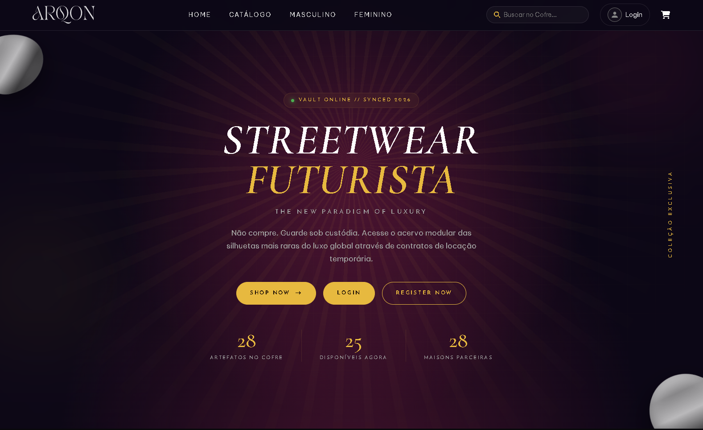
</p>

### 🛍 Catálogo / Filtros
<p align="center">
  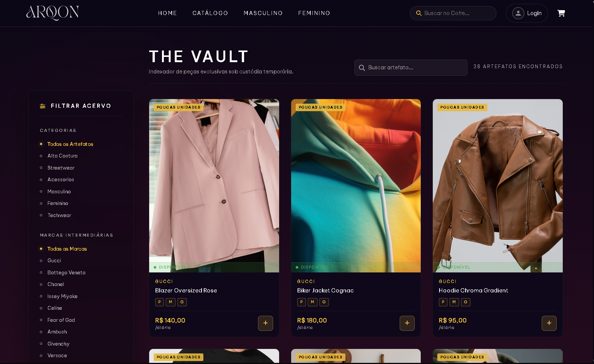
</p>

### 👔 Página Masculino / Feminino
<p align="center">
  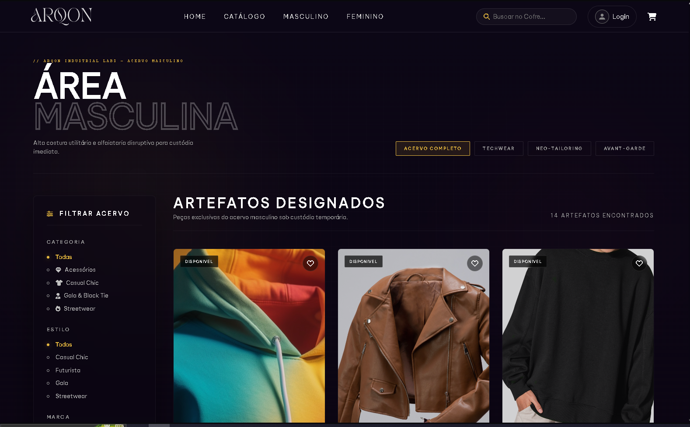
  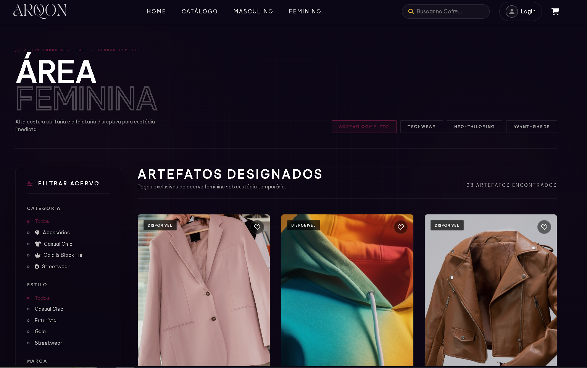
</p>

### 👁 Detalhes do Produto (PDP)
<p align="center">
  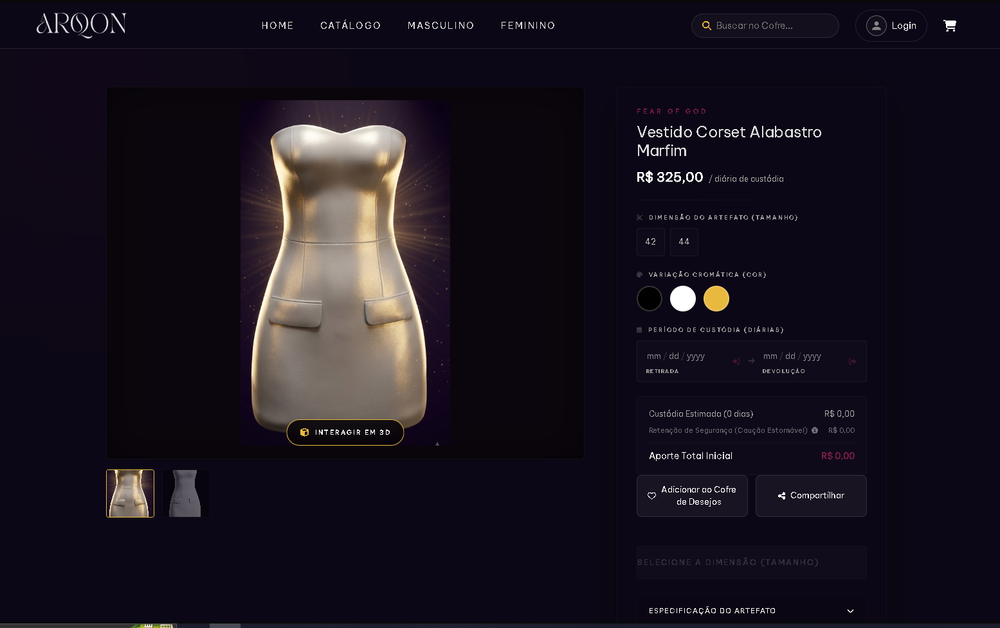
</p>

### 🔐 Login / Registro
<p align="center">
  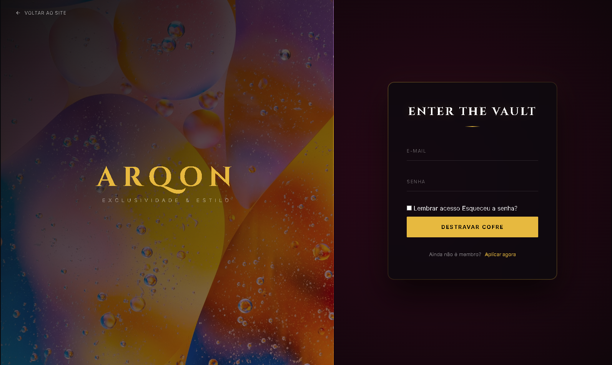
</p>

### 👤 Perfil do Usuário
<p align="center">
  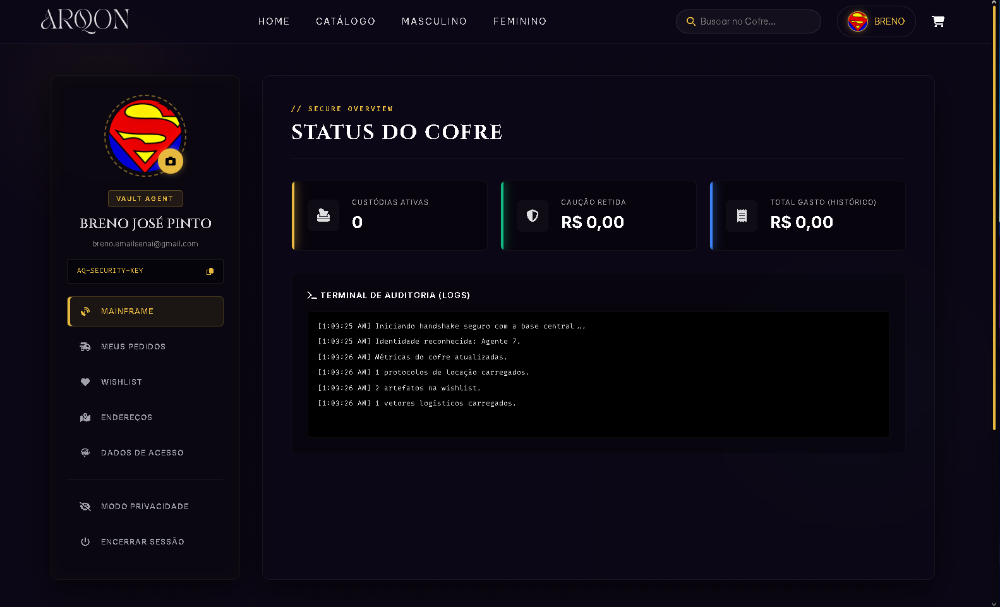
</p>

### 🛒 Carrinho / Checkout
<p align="center">
  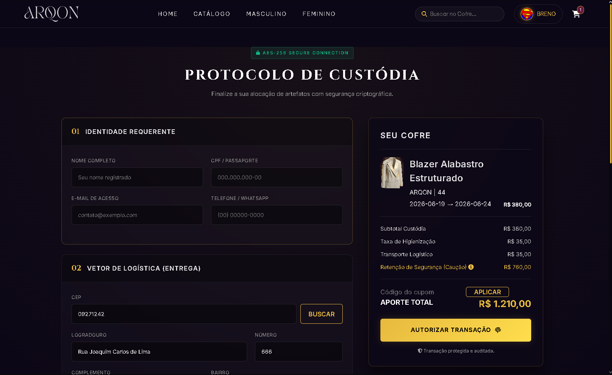
</p>

### 📊 Painel Administrativo
<p align="center">
  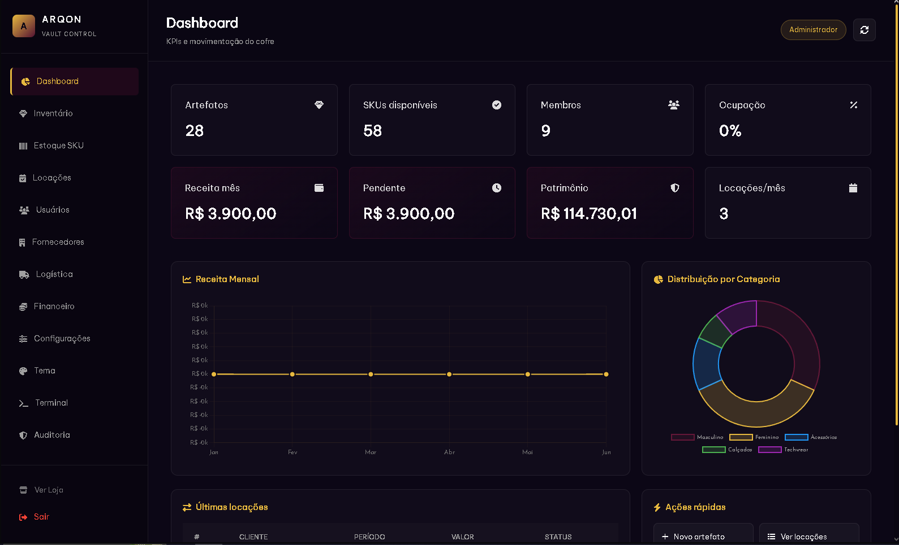
</p>

### 🎨 Editor de Tema (Admin)
<p align="center">
  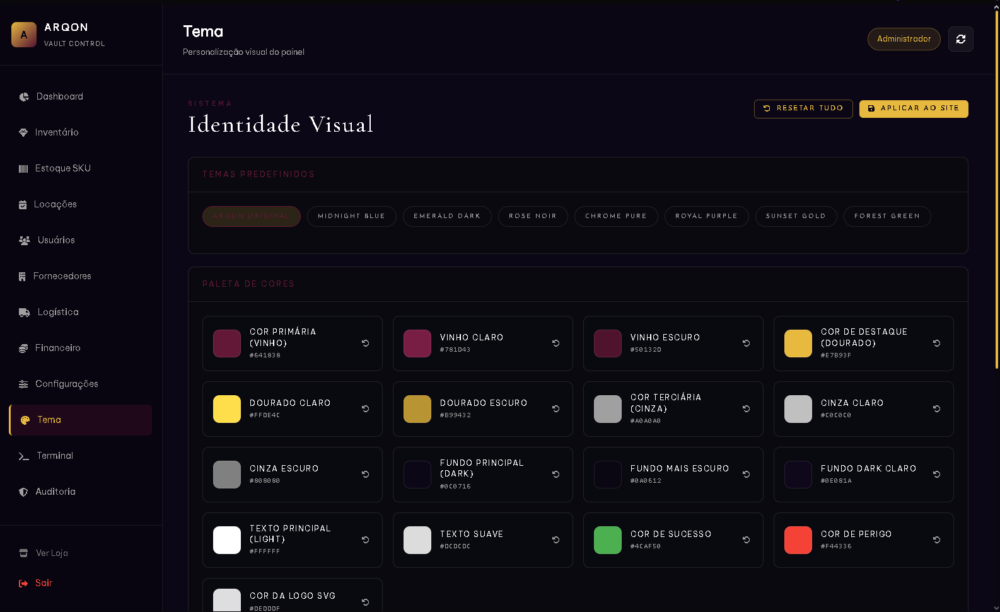
</p>

### 🏷 Painel do Fornecedor
<p align="center">
  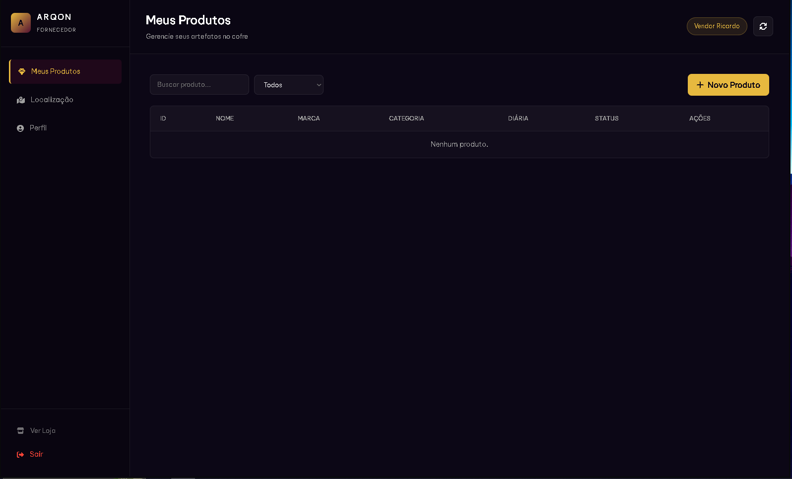
</p>

### 📱 Versão Mobile
<p align="center">
  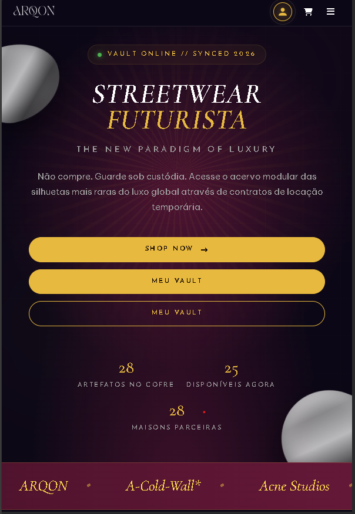
  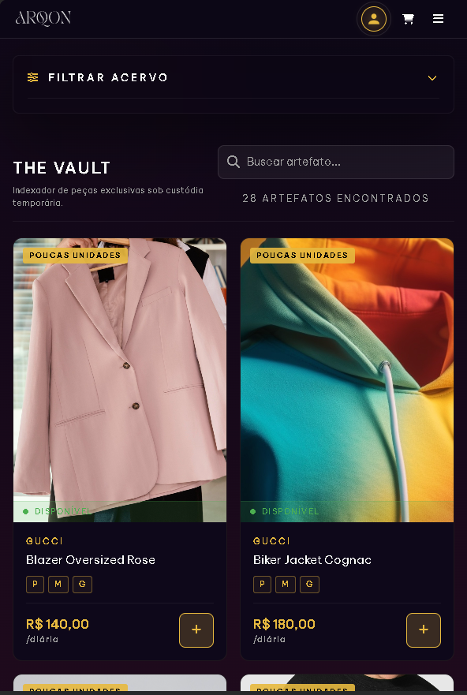
  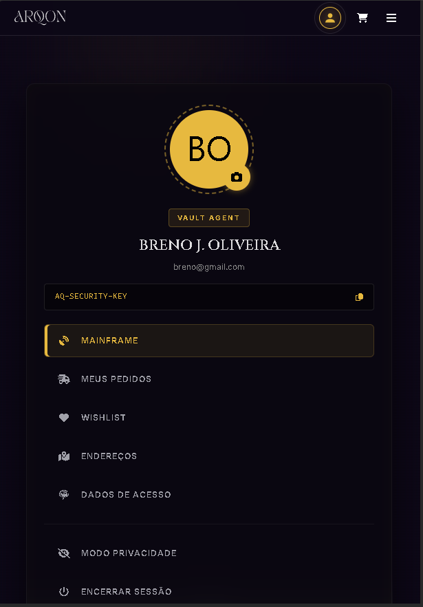
</p>

---

## 🧰 Stack Tecnológico Completo

<p align="center"><strong>Linguagens & Core</strong></p>
<p align="center">
  
  
  
  
  
</p>

<p align="center"><strong>Banco de Dados & Servidor</strong></p>
<p align="center">
  
  
  
  
  
</p>

<p align="center"><strong>Segurança</strong></p>
<p align="center">
  
  
  
  
</p>

<p align="center"><strong>Bibliotecas Front-end</strong></p>
<p align="center">
  
  
  
  
  
</p>

<p align="center"><strong>Ferramentas & Ambiente</strong></p>
<p align="center">
  
  
  
  
  
  
</p>

### ⚙ Back-end
| Tecnologia | Versão | Uso no Projeto |
|---|---|---|
| **PHP** | 8.2+ | API RESTful com `declare(strict_types=1)` e POO |
| **MySQL / MariaDB** | 8.0 / 10.6+ | Banco relacional com engine InnoDB e chaves estrangeiras |
| **PDO** | Nativo | Singleton de conexão (`database.php`), prepared statements em 100% das queries |
| **JWT (HS256)** | Custom (`api/src/utils/JWT.php`) | Autenticação stateless, expiração configurável (padrão 2h) |
| **Argon2id** | Nativo (`PASSWORD_ARGON2ID`) | Hash de senhas recomendado pelo OWASP |
| **Apache** | 2.4+ | `mod_rewrite`, `mod_headers`, `CGIPassAuth` via `.htaccess` |
| **Arquitetura MVC** | — | Roteador central (`index.php`) + Controllers + Models + Middlewares |
| **API RESTful** | — | 80+ endpoints JSON organizados por módulo |

### 🎨 Front-end
| Tecnologia | Uso no Projeto |
|---|---|
| **HTML5 semântico** | 12 páginas + 4 componentes modulares |
| **CSS3** | Design System Dark Luxury, CSS Variables, Grid, Flexbox, `@keyframes`, media queries responsivas |
| **JavaScript ES6+** | Fetch API, async/await, módulos IIFE, manipulação de DOM, `localStorage` |
| **Chart.js 4.x** | Gráficos de métricas no dashboard admin |
| **Leaflet.js 1.9+** | Mapa interativo de logística |
| **Cropper.js 1.6+** | Corte/redimensionamento de avatar e imagens de produto |
| **Componentes modulares** | Header, footer, carrinho e main carregados via `fetch()` |
| **SPA-like routing** | Navegação fluida sem recarregar a página inteira |

### 🔌 APIs & Integrações
| Recurso | Propósito |
|---|---|
| **ViaCEP API** | Preenchimento automático de endereço por CEP |
| **CDNJS / unpkg** | Entrega de bibliotecas externas via CDN |
| **API RESTful própria** | Toda comunicação front ↔ back em JSON |

### 🔤 Tipografia e Ícones
| Recurso | Propósito |
|---|---|
| **Font Awesome 6.4** | Ícones vetoriais (carrinho, usuário, coração, busca) |
| **Google Fonts** | Be Vietnam Pro, Cormorant Garamond, Josefin Sans, Cinzel, Inter |

### 🛠 Ferramentas de Desenvolvimento
| Ferramenta | Uso |
|---|---|
| **XAMPP** | Ambiente local (Apache + PHP + MySQL) |
| **Git & GitHub** | Versionamento e hospedagem do código |
| **VS Code** | Editor de código |
| **Figma** | Prototipação e design da interface |
| **phpMyAdmin** | Administração do banco de dados |
| **InfinityFree** | Hospedagem online (PHP + MySQL gratuito) |

---

## 🏗 Arquitetura do Sistema

O sistema segue uma arquitetura **MVC com roteador central**:

```
┌──────────────┐    HTTP/JSON     ┌──────────────────────────┐
│  FRONT-END   │ ───────────────► │   index.php (ROUTER)     │
│ HTML/CSS/JS  │ ◄─────────────── │  - CORS / Headers        │
│ (public/)    │     Fetch API    │  - switch() de rotas     │
└──────────────┘                  └────────────┬─────────────┘
                                                │
                          ┌─────────────────────┼─────────────────────┐
                          ▼                     ▼                     ▼
                  ┌──────────────┐     ┌──────────────┐      ┌──────────────┐
                  │ Middlewares  │     │ Controllers  │      │   Models     │
                  │ AuthMiddle.. │ ──► │ (18 arquivos)│ ───► │ (13 arquivos)│
                  └──────────────┘     └──────────────┘      └──────┬───────┘
                                                                    ▼
                                                          ┌──────────────────┐
                                                          │  Database (PDO)  │
                                                          │   MySQL/InnoDB   │
                                                          └──────────────────┘
```

**Fluxo de uma requisição:**
1. O front-end faz uma chamada `fetch()` para `/PROJETO-ARQUON/index.php/api/...`.
2. O `.htaccess` redireciona tudo para `index.php`.
3. O roteador extrai a URI (`api/...`), aplica CORS e despacha via `switch`.
4. Rotas protegidas passam pelo `AuthMiddleware` que valida o JWT.
5. O Controller processa, chama o Model correspondente.
6. O Model executa queries PDO no MySQL e retorna dados.
7. A resposta é serializada em JSON e devolvida ao front.

---

## ⚙ Funcionalidades Completas

### 1. Autenticação e Conta
- Login com e-mail e senha (Argon2id).
- Registro de usuário com upload de avatar (Cropper.js).
- JWT com expiração + refresh token automático (`auth-fetch.js`).
- Logout com blacklist de token (`jwt_blacklist`).
- Recuperação de senha (forgot/reset password com token).
- Alteração de senha autenticada.
- Rate limiting anti brute-force no login (`login_attempts`).

### 2. Catálogo de Produtos
- Listagem com filtros por categoria, estilo, marca, cor, gênero, status e preço.
- Ordenação (mais recentes, menor/maior preço).
- Páginas dedicadas: **Masculino**, **Feminino** e **Catálogo Geral**.
- Busca universal (`/api/search`) por produtos, categorias e marcas.
- Paginação / load more e lazy loading de imagens.
- Filtros dinâmicos alimentados por metadados (`/api/marcas`, `/api/categorias`, `/api/estilos`, `/api/cores`).

### 3. Página de Detalhes do Produto (PDP)
- Galeria de imagens com miniaturas.
- Seleção dinâmica de tamanhos e cores (itens de estoque).
- Cálculo de valor da diária e caução (2x diária).
- Avaliações e média de estrelas.
- Botões de adicionar ao carrinho e à wishlist.

### 4. Carrinho e Checkout
- Adicionar / remover / atualizar itens (persistência em `carrinho_temp`).
- Cálculo de subtotal, caução e total.
- Aplicação e validação de cupons de desconto.
- Seleção / cadastro de endereço de entrega.
- Busca de endereço por CEP (ViaCEP).
- Máscara e validação de CPF.
- Finalização da locação (`POST /api/locacoes`).

### 5. Perfil do Usuário
- Edição de dados pessoais.
- Upload e corte de foto de perfil (Cropper.js).
- Histórico de locações.
- Lista de favoritos (wishlist).
- Gerenciamento de endereços (CRUD + endereço padrão).
- Métricas pessoais.

### 6. Painel Administrativo (`admin.html`)
- Dashboard com métricas em tempo real.
- Gráficos Chart.js (vendas, locações).
- CRUD completo de produtos com upload de imagens, duplicação e mudança de status.
- Gestão de estoque (adicionar, status, sincronizar).
- Gerenciamento de usuários (status e nível de acesso).
- Gestão de marcas e cores (CRUD).
- Gestão de locações (atualização de status).
- Audit trail / logs do sistema.
- Mapa de logística (Leaflet).
- Editor de tema dinâmico com 8 presets.
- Exportação de relatórios.

### 7. Painel do Fornecedor (`fornecedor.html`)
- Acesso restrito ao perfil `VENDOR`.
- Gerenciamento dos próprios produtos.

### 8. Sistemas Auxiliares
- Avaliações de produtos (1–5 estrelas + comentário).
- Cupons de desconto (percentual ou fixo).
- Wishlist (favoritos) com verificação de estado.
- Notificações in-app.
- Programa de fidelidade (bronze/prata/ouro/platinum).
- Coleções e celebridades em destaque.
- Toast notifications globais (`toast.js`).
- Scroll reveal animations (`scroll-reveal.js`).

---

## 🖥 Telas / Páginas do Sistema

| Página | Arquivo | Descrição |
|---|---|---|
| **Home** | `public/index.html` | Landing com hero, marquee, new drop, como funciona, categorias, coleção limitada, celebridades, sustentabilidade, sobre, FAQ e newsletter |
| **Masculino** | `public/masculino.html` | Catálogo filtrado por gênero masculino |
| **Feminino** | `public/feminino.html` | Catálogo filtrado por gênero feminino |
| **Catálogo Geral** | `public/catalogo.html` | Catálogo universal com todos os filtros |
| **Produto (PDP)** | `public/produto.html` | Detalhes completos do artefato |
| **Login / Registro** | `public/login.html` | Autenticação e cadastro com avatar |
| **Perfil** | `public/profile.html` | Área do usuário logado |
| **Checkout** | `public/checkout.html` | Carrinho, endereço, cupom e finalização |
| **Admin** | `public/admin.html` | Painel administrativo completo |
| **Fornecedor** | `public/fornecedor.html` | Painel do fornecedor (VENDOR) |
| **Favoritos** | `public/favoritos.html` | Redireciona para a wishlist no perfil |
| **404** | `public/404.html` | Página de erro personalizada |

### Componentes Modulares (`public/components/`)
| Componente | Arquivo | Função |
|---|---|---|
| **Header** | `header.html` + `header.js` | Navegação, busca, menu mobile, estado logado/deslogado |
| **Footer** | `footer.html` | Rodapé com links e newsletter |
| **Botão Carrinho** | `botaocarrinho.html` + `botaocarrinho.js` | Carrinho flutuante com contador |
| **Main** | `main.html` | Bloco de conteúdo reutilizável |

---

## 🔌 API RESTful — Todas as Rotas

Base: `http://localhost/PROJETO-ARQUON/index.php/api`

### 🔐 Autenticação
| Método | Rota | Descrição |
|---|---|---|
| POST | `/api/login` | Login, retorna JWT |
| POST | `/api/register` | Registro com avatar opcional |
| POST | `/api/logout` | Logout (blacklist do token) |
| POST | `/api/refresh-token` | Renova o JWT |
| POST | `/api/forgot-password` | Solicita recuperação de senha |
| POST | `/api/reset-password` | Redefine senha via token |
| POST | `/api/user/alterar-senha` | Altera senha (autenticado) |

### 👤 Usuário
| Método | Rota | Descrição |
|---|---|---|
| GET | `/api/me` | Dados do usuário logado |
| POST | `/api/me/avatar` | Upload de avatar |
| GET | `/api/user/perfil` | Dados do perfil |
| PUT | `/api/user/perfil` | Atualiza perfil |
| GET | `/api/user/metricas` | Métricas do usuário |

### 🎨 Tema
| Método | Rota | Descrição |
|---|---|---|
| GET | `/api/tema` | Lê configuração de tema |
| PUT | `/api/tema` | Atualiza chave de tema |
| GET | `/api/tema/css` | Gera CSS dinâmico |
| PUT | `/api/tema/batch` | Atualiza múltiplas chaves |
| POST | `/api/tema/reset` | Restaura tema padrão |

### 🛡 Admin (protegido)
| Método | Rota | Descrição |
|---|---|---|
| GET | `/api/admin/metricas` | Métricas do dashboard |
| GET | `/api/admin/logs` | Audit trail |
| GET | `/api/admin/usuarios` | Lista usuários |
| GET | `/api/admin/estoque` | Lista estoque |
| GET | `/api/admin/locacoes` | Lista locações |
| GET | `/api/admin/lookups` | Dados auxiliares (selects) |
| GET/PUT | `/api/admin/config` | Configurações do sistema |
| GET | `/api/admin/exportar` | Exporta relatórios |
| GET/POST | `/api/admin/marcas` | Lista/cria marcas |
| POST | `/api/admin/marcas/atualizar` | Atualiza marca |
| POST | `/api/admin/marcas/deletar` | Remove marca |
| GET/POST | `/api/admin/cores` | Lista/cria cores |
| POST | `/api/admin/cores/atualizar` | Atualiza cor |
| POST | `/api/admin/cores/deletar` | Remove cor |
| POST | `/api/admin/usuario/status` | Ativa/inativa usuário |
| POST | `/api/admin/usuario/nivel` | Altera nível de acesso |
| POST | `/api/admin/estoque/adicionar` | Adiciona item ao estoque |
| POST | `/api/admin/estoque/status` | Atualiza status de item |
| POST | `/api/admin/estoque/sincronizar` | Sincroniza estoque |
| PUT | `/api/admin/locacao/atualizar` | Atualiza locação |

### 🛍 Produtos
| Método | Rota | Descrição |
|---|---|---|
| GET | `/api/produtos` | Lista produtos com filtros |
| GET | `/api/produtos/detalhes?id=X` | Detalhes completos (PDP) |
| POST | `/api/produtos/salvar` | Cria produto (admin) |
| POST | `/api/produtos/atualizar` | Atualiza produto (admin) |
| POST | `/api/produtos/deletar` | Remove produto (admin) |
| POST | `/api/produtos/duplicar` | Duplica produto (admin) |
| POST | `/api/produtos/status` | Altera status (admin) |

### 📂 Metadados / Catálogo
| Método | Rota | Descrição |
|---|---|---|
| GET | `/api/marcas` | Lista marcas |
| GET | `/api/categorias` | Lista categorias |
| GET | `/api/estilos` | Lista estilos |
| GET | `/api/cores` | Lista cores |
| GET | `/api/search?q=&tipo=` | Busca unificada |

### 🛒 Carrinho
| Método | Rota | Descrição |
|---|---|---|
| GET | `/api/carrinho` | Lista itens |
| POST | `/api/carrinho` | Adiciona item |
| PUT | `/api/carrinho` | Atualiza item |
| DELETE | `/api/carrinho` | Remove item |
| GET | `/api/carrinho/total` | Calcula total |
| DELETE | `/api/carrinho/limpar` | Esvazia carrinho |

### 📦 Locações
| Método | Rota | Descrição |
|---|---|---|
| GET | `/api/locacoes` | Lista locações |
| POST | `/api/locacoes` | Cria locação |
| DELETE | `/api/locacoes` | Cancela locação |
| GET | `/api/locacoes/detalhes` | Detalhes da locação |
| PUT | `/api/locacoes/status` | Atualiza status |

### ⭐ Avaliações
| Método | Rota | Descrição |
|---|---|---|
| GET | `/api/avaliacoes` | Lista avaliações |
| POST | `/api/avaliacoes` | Publica avaliação |
| DELETE | `/api/avaliacoes` | Remove avaliação |
| GET | `/api/avaliacoes/minhas` | Minhas avaliações |

### ❤ Wishlist
| Método | Rota | Descrição |
|---|---|---|
| GET/POST/DELETE | `/api/wishlist` | Lista/adiciona/remove favorito |
| GET | `/api/wishlist/verificar` | Verifica se produto está na wishlist |

### 🏠 Endereços
| Método | Rota | Descrição |
|---|---|---|
| GET/POST/PUT/DELETE | `/api/enderecos` | CRUD de endereços |
| PUT | `/api/enderecos/padrao` | Define endereço padrão |
| GET | `/api/cep?cep=X` | Busca endereço por CEP |

### 🎟 Cupons
| Método | Rota | Descrição |
|---|---|---|
| GET/POST | `/api/cupons` | Lista/cria cupons |
| POST | `/api/cupons/validar` | Valida cupom |

### 🌟 Coleções e Logística
| Método | Rota | Descrição |
|---|---|---|
| GET | `/api/colecoes` | Lista coleções |
| GET | `/api/colecoes/detalhes` | Detalhes da coleção |
| POST | `/api/colecoes/produto` | Associa produto |
| POST | `/api/colecoes/atualizar` | Atualiza coleção |
| POST | `/api/colecoes/deletar` | Remove coleção |
| GET | `/api/logistica/rastreio` | Rastreia entrega |

### 🏷 Fornecedor (perfil VENDOR)
| Método | Rota | Descrição |
|---|---|---|
| GET/POST/PUT/DELETE | `/api/fornecedor/produtos` | Gerencia produtos próprios |

---

## 🧩 Controllers, Models e Middlewares

### Controllers (`api/src/Controllers/`)
| Arquivo | Responsabilidade |
|---|---|
| `BaseController.php` | Classe base com helpers de resposta |
| `AuthController.php` | Login, registro, rate limiting |
| `AuthControllerExtended.php` | Logout, refresh, recuperação/alteração de senha |
| `UserController.php` | Perfil, avatar e métricas do usuário |
| `AdminController.php` | Dashboard, usuários, estoque, marcas, cores, logs |
| `ProdutoController.php` | CRUD de produtos e uploads |
| `CarrinhoController.php` | Operações de carrinho |
| `LocacaoController.php` | Gestão de aluguéis |
| `AvaliacaoController.php` | Reviews de produtos |
| `WishlistController.php` | Favoritos |
| `EnderecoController.php` | Endereços de entrega |
| `CupomController.php` | Cupons de desconto |
| `CEPController.php` | Integração ViaCEP |
| `ColecaoController.php` | Coleções em destaque |
| `ThemeController.php` | Tema dinâmico |
| `ConfigController.php` | Configurações do sistema |
| `LogisticaController.php` | Rastreio e logística |
| `FornecedorController.php` | Produtos do fornecedor |

### Models (`api/src/Models/`)
`Usuario.php`, `Produto.php`, `AdminModel.php`, `Carrinho.php`, `Locacao.php`, `Avaliacao.php`, `Wishlist.php`, `Endereco.php`, `Cupom.php`, `Colecao.php`, `Fornecedor.php`, `Theme.php`, `Config.php`

### Middlewares e Utils
- `api/src/Middlewares/AuthMiddleware.php` — valida JWT e injeta o usuário/role na requisição.
- `api/src/utils/JWT.php` — geração e verificação de tokens HS256.

---

## 🗄 Banco de Dados

Banco MySQL `arqon` (InnoDB, utf8mb4) organizado em **7 módulos** com 30+ tabelas. Schema completo em `docs/banco_arquon.sql` e diagrama em `docs/Mapa_Banco_arquon.png`.

### Diagrama do Banco de Dados

<p align="center">
  <!-- Substitua pelo caminho real da foto digitalizada do banco -->
  
  <!-- Substitua pelo caminho real do diagrama digital -->
  
</p>

> Coloque a foto física do banco no caminho `docs/foto_banco.jpg` e o diagrama digital em `docs/Mapa_Banco_arquon.png`.

### Módulo 1 — IAM (Identidade e Acessos)
`niveis_acesso`, `usuarios`, `usuarios_enderecos`, `fornecedores`, `api_keys`

### Módulo 2 — Ativos de Luxo (Catálogo)
`marcas`, `categorias`, `estilos`, `cores`, `produtos`, `itens_estoque`, `produto_midias`

### Módulo 3 — Logística e Aluguéis
`locacoes`, `entregas`

### Módulo 4 — Financeiro
`transacoes`

### Módulo 5 — Inteligência e Marketing
`wishlist`, `lookbooks_ia`

### Módulo 6 — Auditoria e Saúde
`sistema_logs`

### Módulo 7 — Configurações e Webhooks
`configuracoes_sistema`, `logs_webhooks`, `jwt_blacklist`

### Tabelas Complementares
`carrinho_temp`, `avaliacoes`, `cupons`, `configuracoes_tema`, `password_resets`, `login_attempts`, `fidelidade`, `notificacoes`, `contatos`, `celebridades`, `celebridade_produtos`, `colecoes`, `colecao_produtos`

A coluna de imagem do produto é `foto_url` (apenas o nome do arquivo). As imagens ficam em `public/uploads/` e são prefixadas no front-end com `/PROJETO-ARQUON/public/uploads/`.

---

## 🔑 Sistema de Autenticação e Níveis de Acesso

O sistema usa **JWT (HS256)** stateless. O token carrega `id_usuario`, `email` e `role`, expira em 2h (configurável) e é renovado automaticamente via `auth-fetch.js`.

### Níveis de Acesso
| ID | Role | Descrição |
|---|---|---|
| 1 | `MEMBER` | Usuário comum (cliente) |
| 2 | `VAULT_MGMT` | Gestão de cofre/estoque |
| 3 | `PRIORITY_ACCESS` | Acesso prioritário |
| 4 | `TOTAL_CONTROL` | Administrador total |
| — | `VENDOR` | Fornecedor (acesso ao painel próprio) |

### Credenciais de Teste
| Perfil | E-mail | Senha |
|---|---|---|
| Admin | `admin@arqon.com` | `admin123` |
| Membro | `user@arqon.com` | `user123` |

---

## 🎨 Sistema de Tema Dinâmico

O tema é carregado por `public/scripts/theme-loader.js`, que busca as configurações via `/api/tema` (tabela `configuracoes_tema`) e aplica como **CSS Variables** no `:root`. Cobre **12 páginas** e **4 componentes**.

**Fluxo:**
1. Busca o tema da API via `fetch()`.
2. Normaliza dados (array ou objeto).
3. Aplica CSS Variables em `document.documentElement`.
4. Converte a cor primária para RGB (`--theme-primary-rgb`).
5. Atualiza a meta tag `theme-color` (mobile).
6. Injeta CSS dinâmico para elementos com cores hardcoded.
7. Faz fallback para `localStorage` se a API falhar.

### 8 Presets
| Preset | Cor Primária | Fundo | Estilo |
|---|---|---|---|
| **ARQON** | `#E7B93F` | `#0C0716` | Dourado clássico luxo |
| **Midnight** | `#C9A227` | `#0A0F1A` | Azul escuro + ouro antigo |
| **Emerald** | `#D4AF37` | `#0A1A0F` | Verde floresta + dourado |
| **Rose** | `#E8B4B8` | `#1A0A10` | Rosa pó + fundo escuro |
| **Chrome** | `#E0E0E0` | `#0A0A0A` | Prata metálica minimalista |
| **Royal** | `#BB8FCE` | `#1A0A1A` | Roxo real + fundo escuro |
| **Sunset** | `#FF7043` | `#1A0A02` | Laranja coral + fundo quente |
| **Forest** | `#C8A951` | `#0A1A02` | Verde musgo + dourado |

O editor fica em **Admin > Configurações > Tema** (`theme-editor.js`), com seletor de preset, color pickers, preview em tempo real, salvar no banco e reset.

---

## 📁 Estrutura de Pastas

```
PROJETO-ARQUON/
├── api/
│   ├── public/                      # Assets públicos da API
│   └── src/
│       ├── Controllers/             # 18 controllers
│       ├── Models/                  # 13 models
│       ├── Middlewares/             # AuthMiddleware.php
│       └── utils/                   # JWT.php
├── public/
│   ├── components/                  # header, footer, botaocarrinho, main
│   ├── scripts/                     # 18 arquivos JS (admin, produto, checkout, theme-loader...)
│   ├── style/                       # 16 arquivos CSS (reset, home-vault, admin, produto...)
│   ├── assets/                      # Imagens e mídias estáticas
│   ├── uploads/                     # Imagens de produtos e avatares
│   ├── index.html                   # Home
│   ├── masculino.html / feminino.html / catalogo.html
│   ├── produto.html / login.html / profile.html
│   ├── checkout.html / admin.html / fornecedor.html
│   ├── favoritos.html / 404.html
│   ├── index.js                     # Bootstrapper compartilhado
│   └── theme-dynamic.css
├── docs/                            # Documentação, SQL e diagramas
│   ├── banco_arquon.sql / drop_tables.sql / seeds.sql
│   ├── Mapa_Banco_arquon.png / modelo_banco.txt
│   └── Claude/ Importante/ Apresentação/
├── capturas/                        # Capturas de tela do README
├── config.php                       # Configuração global (lê .env)
├── database.php                     # Conexão PDO Singleton
├── index.php                        # Roteador central da API
├── .htaccess                        # Rewrite, headers de segurança, CORS
├── .env / .env.example              # Variáveis de ambiente
├── DEPLOY.md                        # Guia de deploy
└── README.md
```

---

## 🔒 Segurança

| Mecanismo | Implementação |
|---|---|
| **Senhas** | Hash Argon2id (`PASSWORD_ARGON2ID`) |
| **Autenticação** | JWT HS256 com expiração e refresh token |
| **Token revogado** | Blacklist em `jwt_blacklist` no logout |
| **SQL Injection** | PDO com prepared statements + `EMULATE_PREPARES=false` |
| **Brute force** | Rate limiting no login (`login_attempts`) |
| **CORS** | Lista explícita de origens permitidas |
| **Headers HTTP** | Segurança configurada no `.htaccess` |
| **Secrets** | Variáveis sensíveis em `.env` (fora do versionamento) |
| **Upload** | Validação de tipo e tamanho de arquivos |
| **Recuperação de senha** | Tokens com hash e expiração (`password_resets`) |

---

## 🎨 Paleta de Cores e Identidade Visual

| Cor | Hex | Uso |
|---|---|---|
| **Dourado ARQON** | `#E7B93F` | Cor primária, destaques, CTAs |
| **Dourado Claro** | `#F5D76E` | Hover, brilho |
| **Void / Fundo** | `#0A0A10` | Fundo máximo |
| **Dark** | `#0C0716` | Fundo de seções |
| **Texto** | `#F2EDE8` | Texto principal |
| **Muted** | `#8A8A9A` | Texto secundário |

**Tipografia:** Cinzel (display), Cormorant Garamond (títulos serifados), Be Vietnam Pro / Inter (corpo), Josefin Sans (detalhes).

---

## 👥 Equipe

| Nome | Função | E-mail |
|---|---|---|
| Breno Oliveira | Desenvolvedor | breno.emailsenai@gmail.com |
| Isabella Dias | Desenvolvedora | isabelladias753@gmail.com |
| Paolla Veronez | Scrum Master | paollap.veronez@gmail.com |
| Rafaela Oliveira | Product Owner | rafaelacristina1510.oliveira@gmail.com |
| Vitor Canali | Desenvolvedor | vitorcanali67@gmail.com |
| Felipe Heitor | Desenvolvedor | felipeheitor@gmail.com |

---

## 🤝 Contatos

<p align="center">
  <a href="https://github.com/Breno-J-Oliveira" target="_blank">
    
  </a>
  <a href="https://www.linkedin.com/in/breno-j-oliveira-672619352/" target="_blank">
    
  </a>
  <a href="https://www.instagram.com/brenoov" target="_blank">
    
  </a>
  <a href="https://x.com/BrenoJOliveira_" target="_blank">
    
  </a>
</p>

---

<p align="center">
  <strong>"A ARQON não é uma loja. É um cofre. Cada peça é um artefato. Cada aluguel é uma experiência."</strong>
</p>
